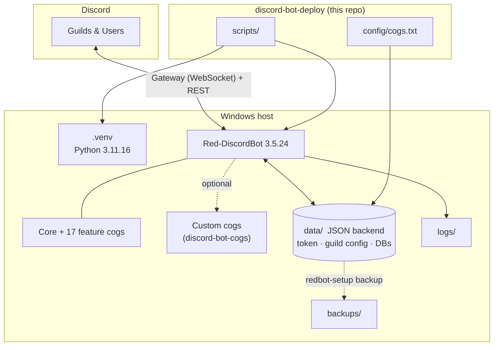

# Architecture

## System overview

Nebula is a self-hosted Discord bot. The bot **engine** is
[Red-DiscordBot](https://github.com/Cog-Creators/Red-DiscordBot) (GPLv3),
installed as a pinned dependency. This repository is the **deployment layer**
around it: environment, configuration, backups and documentation.



## Why it is built this way

| Decision | Chosen | Over | Reason |
| --- | --- | --- | --- |
| Bot engine | Red-DiscordBot (dependency) | Writing a bot, or forking Red | Battle-tested and actively maintained; upstream fixes arrive for free and there is no fork to merge. |
| Python | 3.11 | 3.12 (the host default) | Red declares `python_requires = ">=3.8.1,<3.12"`. Installing on 3.12 is unsupported. |
| Installer | Standard `venv` + pip | `pipx` / `uv tool` | Red installs cog dependencies into its own environment at runtime via pip; pip-less tool environments can break `[p]cog install`. |
| Cog loading | Explicit list in `config/cogs.txt` | Red's (empty) default | Red ships every cog **unloaded**; the deploy sets the intended surface deterministically and unattended. |
| Storage | JSON backend | PostgreSQL | Single writer, small scale. PostgreSQL is a documented upgrade path (`redbot-setup convert`). |
| Secrets | Live only in `data/` (gitignored) | A `.env` or committed config | The token never touches version control. |

## Data layout

```
data/                      # gitignored — the instance's runtime state
├── core/
│   ├── settings.json      # global config: token, owner, prefix, packages
│   └── logs/              # Red's own rotating logs
└── cogs/                  # per-cog persisted data
```

`config/cogs.txt` is the source of truth for which bundled cogs load;
`scripts/load-cogs.ps1` applies it to `data/core/settings.json`.

## Failure and recovery

- **Bot crashes** → restart with `scripts/run-loop.ps1` (supervised) or a
  boot-time service (see `docs/setup.md`).
- **Bad config change** → `scripts/load-cogs.ps1` writes a `.bak` beside the
  settings file before editing.
- **Data loss** → restore the newest folder from `backups/` (created by
  `scripts/backup.ps1` via Red's built-in backup).
- **Upstream breakage** → `scripts/update.ps1` reinstalls Red; there is no fork
  to reconcile.
